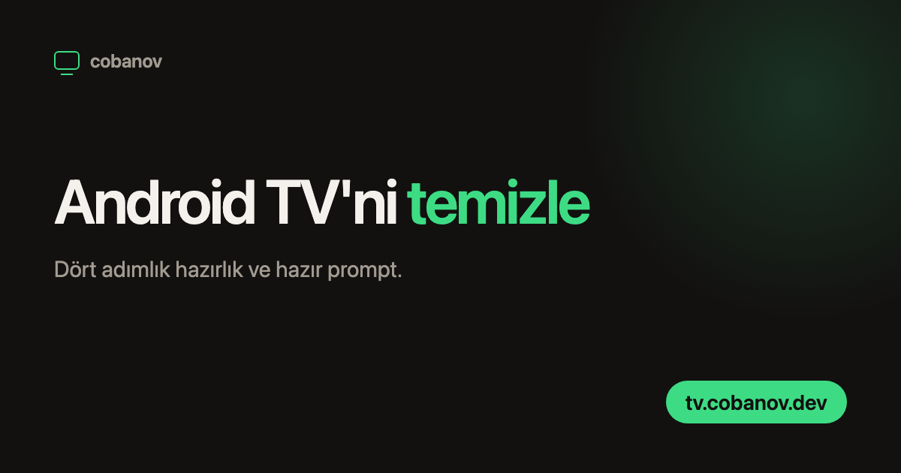

<p align="center">
  
</p>

<p align="center">
  Android TV'yi ADB ile temizlemek için tek sayfalık rehber ve<br>
  yapay zekâ ajanına yapıştırılacak hazır prompt. On dilde.
</p>

<p align="center">
  <a href="https://tv.cobanov.dev">tv.cobanov.dev</a>
</p>

<p align="center">
  
  
  
  
</p>

---

Android TV kutudan çıktığı gibi ana ekranını reklam ve öneri şeritlerine ayırıyor,
hiç açmadığın on beş fabrika uygulamasını arka planda tutuyor ve iki yıl sonra
kumandaya basınca bekletiyor. İnternetteki çözümlerin çoğu root, bootloader açma ya
da custom ROM diyor. Üçü de televizyonu fabrika ayarlarına döndürüyor, üstüne
Widevine sertifikası L1'den L3'e düşerse Netflix SD'ye iniyor. Kazanç yok.

Gereken şey `adb` ve tek bir komut ailesi: `pm disable-user`. Uygulama silinmiyor,
sadece kapatılıyor, ve `pm enable` ile geri geliyor. Sayfadaki prompt bunu bir yapay
zekâ ajanına anlatıyor: ajan aracı kuruyor, televizyona bağlanıyor, önce ölçüyor,
sonra temizliyor.

- **Hiçbir şey silinmiyor.** Prompt `pm uninstall` kullanmayı açıkça yasaklıyor,
  yalnızca `pm disable-user --user 0`. Beğenmediğin her değişiklik tek komutla geri
  alınıyor.
- **Root, bootloader, custom ROM yok.** Prompt bunları önermeyi de yasaklıyor.
- **Önce ölçüyor.** Başlamadan `dumpsys meminfo` ve paket listeleri dosyaya
  alınıyor, sonunda aynı ölçüm tekrarlanıp önce/sonra tablosu çıkıyor.
- **On dil, tek şablon.** Aynı `index.template.html` on ayrı JSON'la dolduruluyor,
  Arapça dahil.
- **Sunucu yok.** Statik sayfa, Cloudflare Pages.

## Kullanım

Televizyonda geliştirici seçeneklerini ve USB hata ayıklamayı aç, IP adresini not et,
[tv.cobanov.dev](https://tv.cobanov.dev) adresindeki prompt'u kopyala, ilk iki
satırdaki `BURAYA YAZ` yerlerine modeli ve IP'yi yaz, Claude Code ya da Codex'e ver.
Sayfadaki dört adım bunu ekran ekran anlatıyor.

Prompt ayrıca `prompt.txt` olarak da yayınlanıyor, yani doğrudan indirilebiliyor:

```sh
curl https://tv.cobanov.dev/prompt.txt
curl https://tv.cobanov.dev/tr/prompt.txt
```

## Diller

Varsayılan dil İngilizce ve kökte duruyor. Diğerleri `/<kod>/` altında.

| Dil | Yol | Dil | Yol |
|---|---|---|---|
| English | `/` | Italiano | `/it/` |
| Türkçe | `/tr/` | Русский | `/ru/` |
| Français | `/fr/` | 日本語 | `/ja/` |
| Español | `/es/` | العربية | `/ar/` |
| Deutsch | `/de/` | 简体中文 | `/zh/` |

İngilizce eskiden `/en/` altındaydı. `public/_redirects` o adresleri köke 301 ile
taşıyor, eski bağlantılar kırılmıyor.

## Yapı

| Dosya | Ne |
|---|---|
| `index.template.html` | Tek sayfa şablonu. `{{anahtar}}` yer tutucuları doldurulur. |
| `i18n/<kod>.json` | O dilin bütün metinleri. Değerler HTML parçası içerebilir. |
| `prompts/<kod>.txt` | O dilin prompt'u. Sayfaya gömülür, ayrıca `prompt.txt` olarak yayınlanır. |
| `assets/site.css` | Tüm stil. Arapça için mantıksal özellikler, CJK ve Arapça için dile göre yazı tipi. |
| `assets/og.template.html` | Sosyal medya görselinin kaynağı. |
| `assets/og-<kod>.png` | 1200x630 sosyal medya önizlemesi, dil başına bir tane. |
| `build.py` | `public/` klasörünü üretir. |
| `build.sh` | `build.py` + dosya kopyalama. |
| `og.sh` | Sosyal medya görsellerini headless Chrome ile yeniden üretir. |

## Geliştirme

```sh
./build.sh
cd public && python3 -m http.server 8899
```

Sayfalar arası bağlantılar göreli, yani `public/index.html` dosyadan da açılır; ama
`_redirects` yalnızca Cloudflare'de çalışır.

Sosyal medya görsellerini yeniden üretmek için (macOS, Chrome gerekir):

```sh
./build.sh && ./og.sh
```

### Yeni dil ekleme

1. `i18n/<kod>.json` yaz. Mevcut bir dili kopyalayıp çevirmek en hızlısı; `path`,
   `name`, `og_locale` ve `dir` alanlarını unutma.
2. `prompts/<kod>.txt` yaz.
3. `build.py` içindeki `ORDER` listesine kodu ekle, `OG` sözlüğüne de bir satır
   (yazı tipi, başlık puntosu, başlık genişliği, harf aralığı).
4. `./build.sh && ./og.sh`

Sağdan sola yazılan bir dil eklerken JSON'da `"dir": "rtl"` yeter; stil zaten mantıksal
özelliklerle yazıldı.

Başlık puntosunun dilden dile değişmesinin sebebi şu: `ch` birimi Latin `0` genişliğine
dayanıyor, o yüzden CJK başlığa dar geliyor, sıkıştırılmış harf aralığı da yalnızca
Latin harfte doğru duruyor. Sabit bir punto on dilde birden taşıyor.

## Yayınlama

Cloudflare Pages projesi: `tv`

```sh
./build.sh
wrangler pages deploy public --project-name tv --branch main
```
