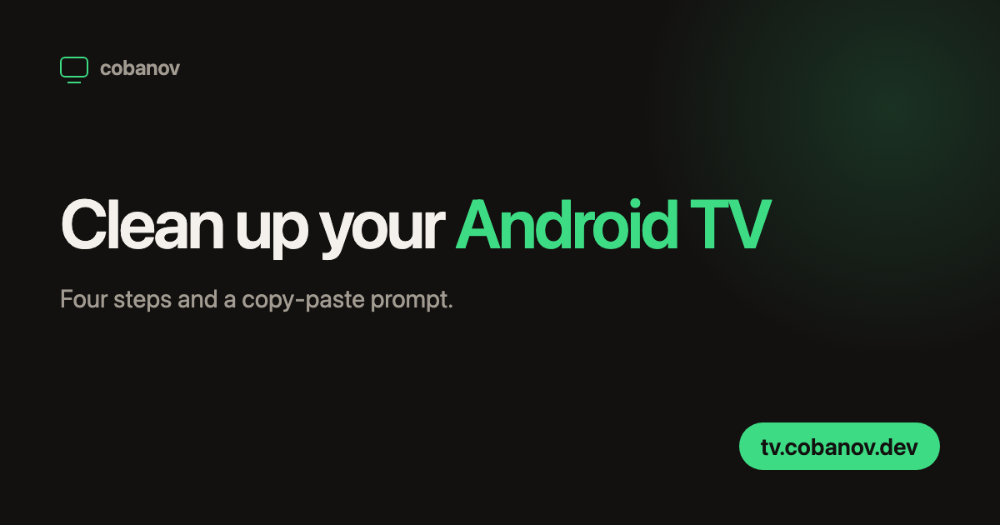

<p align="center">
  
</p>

<p align="center">
  A one-page guide to cleaning up an Android TV over ADB,<br>
  and a prompt to hand to an AI agent. In ten languages.
</p>

<p align="center">
  <a href="https://tv.cobanov.dev">tv.cobanov.dev</a>
</p>

<p align="center">
  
  
  
  
</p>

---

An Android TV arrives with its home screen given over to ad and recommendation rows,
fifteen factory apps you never open running behind them, and, two years later, a
noticeable pause between pressing a button on the remote and anything happening.

Most of the advice online answers this with root, an unlocked bootloader, or a custom
ROM. All three factory-reset the television, and if the Widevine certificate drops
from L1 to L3 on the way, Netflix falls back to SD. There is nothing to gain.

What the job actually needs is `adb` and one family of commands: `pm disable-user`.
Nothing is removed, only switched off, and `pm enable` brings it back. The prompt on
the site explains that to an AI agent, which installs the tool, connects to the
television, measures first, and then cleans up.

- **Nothing is uninstalled.** The prompt forbids `pm uninstall` outright and allows
  only `pm disable-user --user 0`, so any change you dislike is one command away from
  being undone.
- **No root, no bootloader, no custom ROM.** The prompt is told not to suggest them
  either, along with the reason.
- **It measures first.** `dumpsys meminfo` and the package lists are captured to a
  file before anything changes, then taken again at the end for a before-and-after
  table.
- **Ten languages from one template.** The same `index.template.html` filled from ten
  JSON files, Arabic included.
- **No server.** A static page on Cloudflare Pages.

## Use

Turn on developer options and USB debugging on the television, note its IP address,
copy the prompt from [tv.cobanov.dev](https://tv.cobanov.dev), fill in the model and
the IP where the first two lines say so, and hand it to Claude Code or Codex. The four
steps on the page walk through that screen by screen.

The prompt is also published as `prompt.txt`, so it can be fetched directly:

```sh
curl https://tv.cobanov.dev/prompt.txt
curl https://tv.cobanov.dev/tr/prompt.txt
```

## Languages

English is the default and sits at the root. The rest live under `/<code>/`.

| Language | Path | Language | Path |
|---|---|---|---|
| English | `/` | Italiano | `/it/` |
| Türkçe | `/tr/` | Русский | `/ru/` |
| Français | `/fr/` | 日本語 | `/ja/` |
| Español | `/es/` | العربية | `/ar/` |
| Deutsch | `/de/` | 简体中文 | `/zh/` |

English used to live under `/en/`. `public/_redirects` moves those addresses to the
root with a 301, so links people already have keep working.

## Layout

| File | What it is |
|---|---|
| `index.template.html` | The single page template. `{{key}}` placeholders are filled in. |
| `i18n/<code>.json` | Every string for that language. Values may contain HTML fragments. |
| `prompts/<code>.txt` | That language's prompt. Embedded in the page and also published as `prompt.txt`. |
| `assets/site.css` | All the styling. Logical properties for Arabic, per-language fonts for CJK and Arabic. |
| `assets/og.template.html` | Source of the social card. |
| `assets/og-<code>.png` | The 1200x630 social preview, one per language. |
| `build.py` | Produces `public/`. |
| `build.sh` | `build.py` plus the file copying. |
| `og.sh` | Regenerates the social cards through headless Chrome. |

## Development

```sh
./build.sh
cd public && python3 -m http.server 8899
```

Links between pages are relative, so `public/index.html` opens from the filesystem
too. `_redirects` only works on Cloudflare.

To regenerate the social cards (macOS, needs Chrome):

```sh
./build.sh && ./og.sh
```

### Adding a language

1. Write `i18n/<code>.json`. Copying an existing language and translating it is the
   fastest route; do not forget `path`, `name`, `og_locale` and `dir`.
2. Write `prompts/<code>.txt`.
3. Add the code to `ORDER` in `build.py`, and a row to the `OG` dictionary (font,
   heading size, heading width, letter spacing).
4. `./build.sh && ./og.sh`

For a right-to-left language, `"dir": "rtl"` in the JSON is enough; the stylesheet was
written with logical properties from the start.

The heading size varies by language for a specific reason: the `ch` unit is based on
the width of a Latin `0`, so it comes out too narrow for a CJK heading, and the
tightened letter spacing only looks right on Latin script. A single fixed size
overflows in several of the ten at once.

## Deploy

Cloudflare Pages project: `tv`

```sh
./build.sh
wrangler pages deploy public --project-name tv --branch main
```
